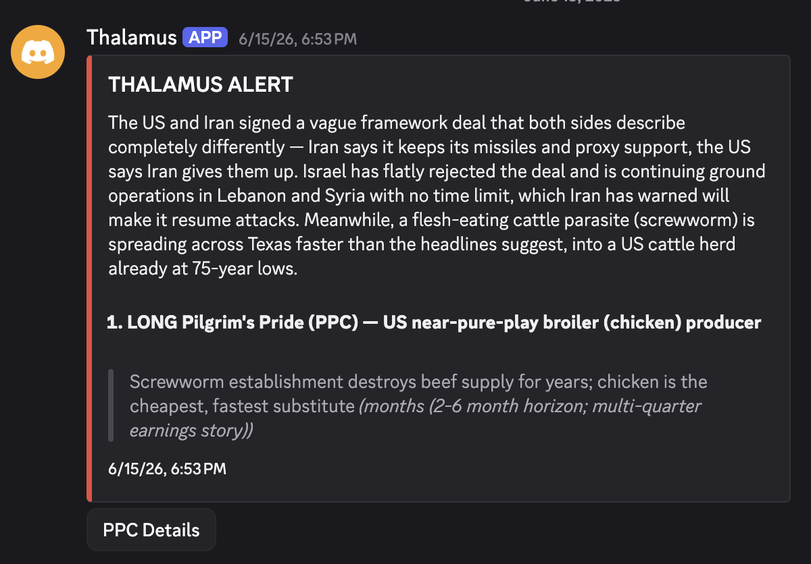

# thalamus

An agent that reads the news all day and looks for non-obvious things that might move markets. It runs on its own, builds up a picture of what's going on in the world, and posts trade ideas to a Discord channel when it finds something worth a look.

I mostly built this to learn how to design a real agent. Markets are a good forcing function because you find out pretty fast when the agent is wrong.

  

## What it does

- Pulls from 24+ news and data feeds on a schedule, including a global animal-disease feed for supply-shock signals
- Keeps a running "world model" of what's happening, and updates it each scan so it builds on what it already knows
- Runs a deeper analysis pass with Claude to connect things across feeds and come up with theses
- Red-teams its own ideas before it alerts. A separate pass tries to poke holes in each thesis, and that verdict shows up in the alert so a weak idea doesn't read like a clean buy
- Filters out low-confidence ideas, dedupes theses it has already flagged, and skips anything I can't actually trade
- Posts to Discord. I can also kick off a manual scan or browse the world model with commands

## How it works

It's a Python service that runs in Docker on a schedule. Each cycle it ingests the feeds, reconciles them into the world model, runs the analysis on Opus, red-teams the output, applies the filters, and posts whatever survives.

A few things I cared about getting right:

- It self-corrects over time. I tuned the certainty so it backs off old assumptions when fresh information shows up.
- It tracks cost per call, so I always know what a scan run actually costs me.
- It checks ideas against my current portfolio so it doesn't tell me to buy more of what I already hold.

## Stack

Python, Claude (Opus 4.8), Docker. Pulls from a set of RSS feeds plus a few scraped sources.

## Status

Runs on its own on a schedule. This is a personal project I built to learn agent design, so treat anything it outputs as an experiment, not financial advice.
